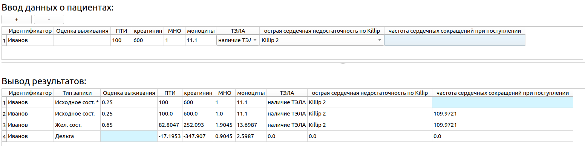
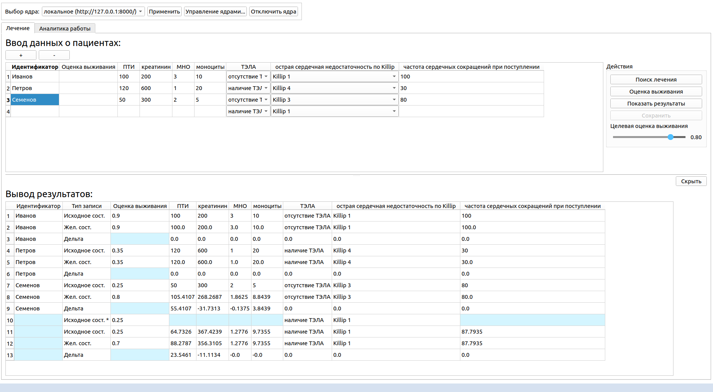
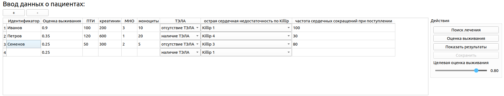
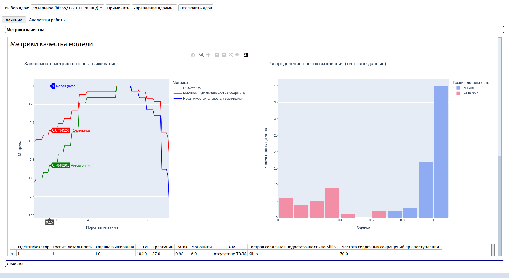
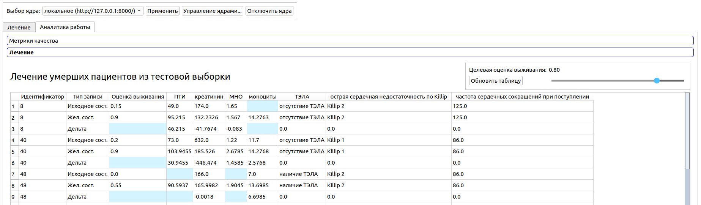
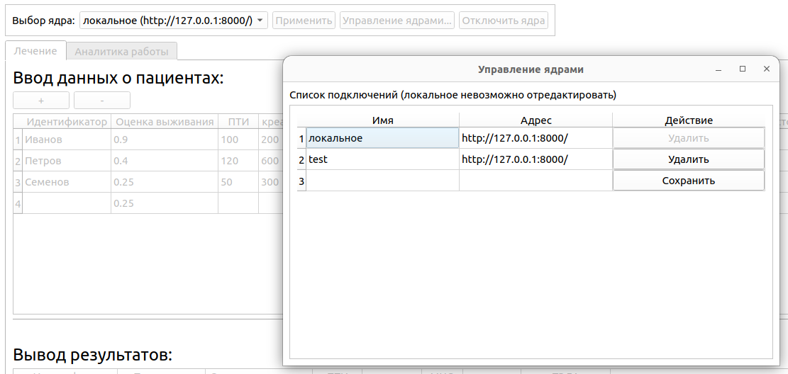

Система формирования персональных рекомендаций для лечения инфаркта миокарда
========

Установка и запуск приложения
----
 ### Установка
```
git clone https://github.com/EduardLimonov/inf-desktop.git
```

#### Linux
```
cd inf-desktop
chmod +x setup.sh
./setup.sh
```

#### Windows
Запуск скрипта `inf-desktop/setup.sh`

### Запуск приложения

#### Активировать виртуальное окружение
```
source venv/bin/activate
```

#### Запуск в стандартном режиме (клиент-сервер)
`python src/main.py`

#### Запуск в аварийном режиме (невозможно развернуть сервер)
`python src/main_local.py`

### Конфигурация приложения
Файлы конфигурации:
- `resource/core_manager/core_manager.json` -- настройки подключений; 
- `resource/defines/defines.json` -- настройки переменных, используемых в ядре; 

Описание приложения
----

### Описание задачи
Рассматриваются пациенты с инфарктом миокарда, имеющие онкологические заболевания различной степени выраженности 
осложнений. Состояние каждого пациента на входе определяется набором параметров: результаты клинических
анализов, информация о заболевании и осложнениях ('ПТИ','ТЭЛА', 'креатинин', 'МНО', 'моноциты', 'острая сердечная 
недостаточность по Killip', 'частота сердечных сокращений при поступлении').

Эти параметры делятся на изменяемые, трудноизменяемые и неизменяемые. **Лечение пациента представляет собой следующее**.
1) Стандартное лечение инфаркта миокарда (приблизительно одинаковое для всех пациентов);
2) Индивидуальное воздействие на организм пациента (изменение параметров его состояния, например, креатинина).

Система формирует рекомендации для применения в п.2. Вывод системы: желаемое состояние пациента как набор 
параметров; желаемое состояние получено из исходного изменением допустимых параметров при минимизации воздействия на 
пациента. 

Пример:


Здесь пользователь не ввёл информацию о ЧСС при поступлении, система восстановила это пропущенное значение и вывела 
рекомендации.

### Описание интерфейса
Общий вид главной страницы:


Пользователь вводит информацию о пациентах, выбирает целевую оценку выживания, нажимает кнопку "Поиск лечения" и 
получает рекомендации в виде таблицы снизу (таблица скрывается/раскрывается кнопками "Скрыть"/"Показать результаты").

Кнопка "Оценка выживания" приводит к заполнению соответствующего столбца таблицы входных данных:


Раздел "Аналитика работы" содержит информацию о метриках качества классификации ("выжил" / "не выжил") при разных 
значения оценки выживания, а также примеры рекомендаций по лечению. Все данные строятся на тестовой выборке.



В шапке приложения расположены элементы переключения ядер (см. **описание структуры клиент-серверного приложения**). На 
рисунке окно настройки подключений (после нажатия на кнопку "Управление ядрами..."):


Здесь пользователь указывает сервер, на котором развернуто ядро приложения.

### Описание структуры клиент-серверного приложения
Ядром называется функционал, включающий в себя всю логику построения оценки выживания, рекомендаций, информацию о 
необходимых колонках таблицы и их допустимых значениях, и т.д. При целевом сценарии ядро запускается на отдельном 
сервере, с которым устанавливается соединение из приложения.

При запуске приложения, в случае, если локальное ядро не запущено, производится его запуск, и отключение в момент 
штатного завершения работы приложения. Список всех соединений и значения по умолчанию сохраняется (в т.ч. при 
перезапуске).

Подобная модель позволяет исключить необходимость обновления клиентской части приложения, и при необходимости обновлять
только сервер с запущенным ядром.

В случае возникновения ошибки или при нажатии кнопки "Отключить ядра" приложение переходит в аварийный режим работы с 
монолитной структурой: код ядра импортируется в виде модуля.